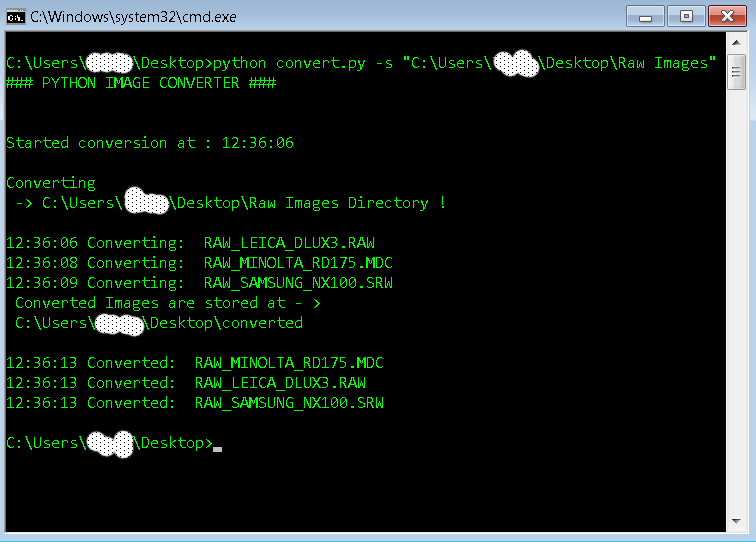

# Python Image Converter
## This application is designed to run with Python 2.7

## This is a simple Image converter written in Python
The app is using PIL ,rawpy and imageio . 
Files are converted to .jpg format 

## Convert for FREE multiple image files
I saw all kinds of software out there but when you have hundrends of raw images is tedious to convert 
one by one! Other Options were to get program suits like photoshop or even pay! 
# Notes
The .ai files are renamed as .pdf and moved to the converted directory !!! 


# What files can be used ?
### DNG , CR2 , CRW, NEF , PEF, ERF , ORF , PPM , MOS , MRF , MRW , SRW and more!!!
Personally i convert a lot of .psd , .TIF and .dng files !!! 
## Speed
This script is multithreaded and checks if you have already converted an image!
### Before you can use it Install :
```
 pip install Image 
 pip install rawpy
 pip install imageio 
 
```
### Example usage

```
 git clone https://github.com/Cyb3rN4u7/Python-Image-Converter.git [my-app-name]
 cd [my-app-name]
 cd app
 python convert.py -s <Enter-Path-Of-Directory>
```
* The -s argument is where you set the path to the directory you want to convert! 

The application will create a folder 'converted' where all your converted images are located!

And you are done! 

## ScreenShot


